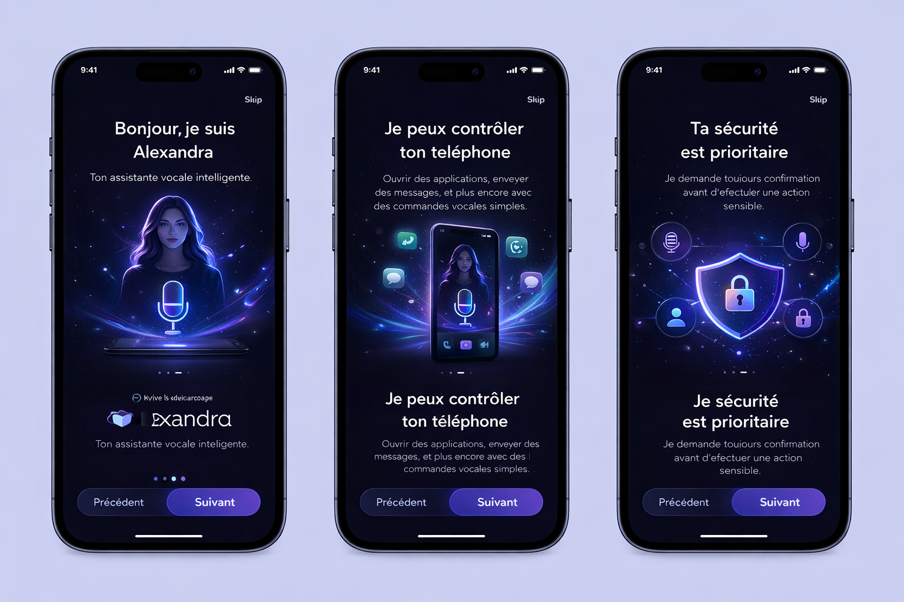
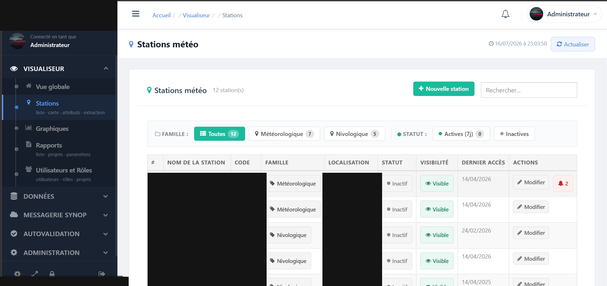
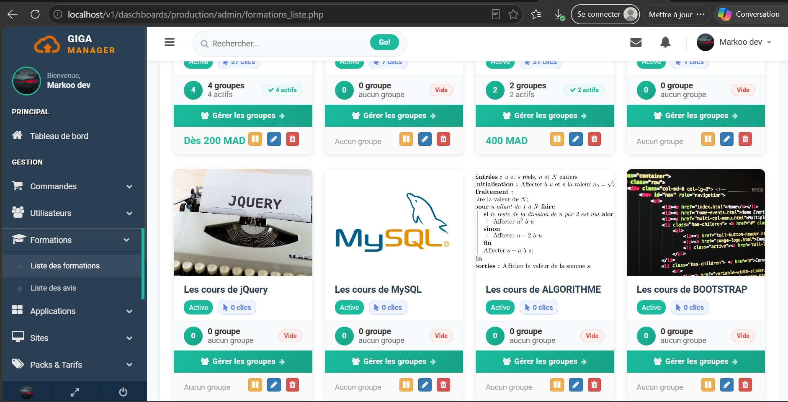
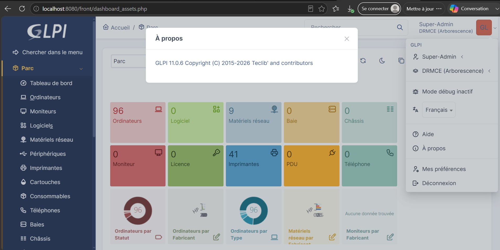
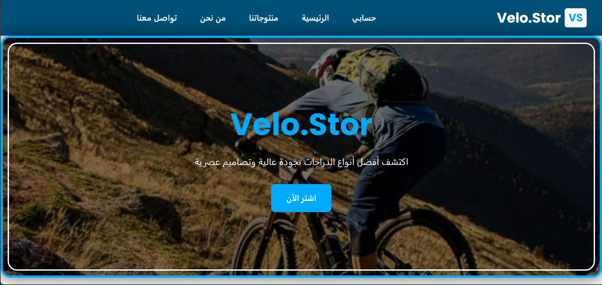

<!DOCTYPE html>
<html lang="de">
<head>
    <meta charset="UTF-8" />
    <meta name="viewport" content="width=device-width, initial-scale=1.0" />
    <title>Leila El Tousy — Anwendungsentwicklerin</title>
    <meta name="description" content="Leila El Tousy — Anwendungsentwicklerin aus Marokko, auf der Suche nach einer Ausbildung als Fachinformatikerin für Anwendungsentwicklung in Deutschland, 2027." />
    <link rel="preconnect" href="https://fonts.googleapis.com">
    <link rel="preconnect" href="https://fonts.gstatic.com" crossorigin>
    <link href="https://fonts.googleapis.com/css2?family=Inter:opsz,wght@14..32,400;14..32,500;14..32,600;14..32,700&family=JetBrains+Mono:wght@400;500;600&display=swap" rel="stylesheet">
    
</head>
<body>

    <a class="skip-link" href="#main">Zum Inhalt springen</a>

    <nav class="topnav">
        

            <a class="brand" href="#top">leila.dev</a>
            <ul class="navlinks" id="navlinks">
                <li><a href="#about" class="active">Über mich</a></li>
                <li><a href="#education">Ausbildung</a></li>
                <li><a href="#projects">Projekte</a></li>
                <li><a href="#skills">Fähigkeiten</a></li>
                <li><a href="#contact" class="nav-cta">Kontakt</a></li>
            </ul>
        

    </nav>

    <main id="main">
        

            <!-- ===== HERO ===== -->
            <header class="hero" id="top">
                

                    

                        
                            
                            Suche Ausbildung — 2027
                        
                        <h1>
                            Leila El Tousy
                        </h1>
                        

                            Anwendungsentwicklerin aus Marokko, auf dem Weg zur
                            <strong>Ausbildung als Fachinformatikerin für Anwendungsentwicklung</strong>
                            in Deutschland.
                        

                        

                            Ich lerne durch praktisches Tun — jedes Projekt auf dieser Seite löst ein echtes Problem oder bringt mir etwas Neues bei. Python, PHP, JavaScript und einige Praktika, bei denen ich Dinge gebaut habe, die tatsächlich genutzt wurden.
                        

                        

                            <a class="btn btn-primary" href="https://github.com/El-Tousy" target="_blank" rel="noopener">GitHub ansehen</a>
                            <a class="btn btn-secondary" href="mailto:leilaeltousy@gmail.com">Kontaktiere mich</a>
                        

                    

                    

                        

                            
                            
                            
                            leila@devbook — zsh
                        

                        

                    

                

            </header>

            <!-- ===== ABOUT ===== -->
            <section id="about">
                
Über mich

                <h2 class="section-title">Ein wenig über mich</h2>
                

                    

                        

                            Ich habe einen Abschluss in Informatik und bereite derzeit meine Bewerbungsunterlagen für eine <strong>Ausbildung in Deutschland</strong> vor. Mein DUT wird von der ANABIN als gleichwertig mit einem deutschen Berufsfachschulabschluss anerkannt — der praxisorientierte Weg ist genau das, was ich suche.
                        

                        

                            Statt mich nur auf die Theorie zu beschränken, habe ich das letzte Jahr damit verbracht, in meinen Praktika konkrete Dinge zu bauen: Dashboards, WhatsApp-Bot, IT-Infrastruktur-Migration. Ich möchte das in einem deutschen Unternehmen fortsetzen und meinen Beruf vor Ort lernen.
                        

                        <ul class="about-facts">
                            <li>Basiert in Marokko — bereit, nach Deutschland zu ziehen</li>
                            <li>Deutsch B1: Hören, Lesen, Sprechen bestanden; Schreiben in Vorbereitung</li>
                            <li>Außerdem fließend in Arabisch, Französisch und Englisch</li>
                        </ul>
                    

                    

                        

                            

                                
6

                                
abgeschlossene Projekte

                            

                            

                                
3

                                
absolvierte Praktika

                            

                            

                                
B1

                                
Deutsch (ÖSD)

                            

                            

                                
2027

                                
angestrebter Start

                            

                        

                    

                

            </section>

            <!-- ===== EDUCATION ===== -->
            <section id="education">
                
Ausbildung

                <h2 class="section-title">Werdegang</h2>
                <ul class="timeline">
                    <li>
                        2023 – 2024
                        
Marokkanisches Abitur

                        
Schwerpunkt Physik &amp; Chemie, Marokko. Mit der Note "Sehr Gut" abgeschlossen.

                    </li>
                    <li>
                        2024 – 2026
                        
Diplôme Universitaire de Technologie (DUT) — Informatik

                        
École Supérieure de Technologie, Marokko. Zwei Praktika absolviert. Von der ANABIN als gleichwertig mit einem deutschen Berufsfachschulabschluss anerkannt.

                    </li>
                </ul>
            </section>

            <!-- ===== PROJECTS ===== -->
            <section id="projects">
                
Projekte

                <h2 class="section-title">Was ich gebaut habe</h2>
                

                    <!-- PROJET 1 -->
                    <article class="project-card">
                        

                            
                        

                        

                            

                                <h3 class="project-title"><a href="https://github.com/El-Tousy/Alexandra-AI-Voice-Assistante" target="_blank" rel="noopener">Alexandra — KI-Sprachassistent</a></h3>
                                Abschlussprojekt · 2026
                            

                            
Android-Sprachassistent, der Spracherkennung, einen OpenAI-gesteuerten Chat und intelligente Erinnerungen kombiniert — mit einem PHP/JS-Dashboard für die Verwaltung, alles basierend auf Firebase.

                            

                                KotlinJavaOpenAI APIFirebaseHTML/CSS/JS
                            

                            

                                <a href="https://github.com/El-Tousy/Alexandra-AI-Voice-Assistante" target="_blank" rel="noopener" class="project-link">
                                    <svg viewBox="0 0 16 16" aria-hidden="true"><path d="M8 0C3.58 0 0 3.58 0 8c0 3.54 2.29 6.53 5.47 7.59.4.07.55-.17.55-.38 0-.19-.01-.82-.01-1.49-2.01.37-2.53-.49-2.69-.94-.09-.23-.48-.94-.82-1.13-.28-.15-.68-.52-.01-.53.63-.01 1.08.58 1.23.82.72 1.21 1.87.87 2.33.66.07-.52.28-.87.51-1.07-1.78-.2-3.64-.89-3.64-3.95 0-.87.31-1.59.82-2.15-.08-.2-.36-1.02.08-2.12 0 0 .67-.21 2.2.82.64-.18 1.32-.27 2-.27.68 0 1.36.09 2 .27 1.53-1.04 2.2-.82 2.2-.82.44 1.1.16 1.92.08 2.12.51.56.82 1.27.82 2.15 0 3.07-1.87 3.75-3.65 3.95.29.25.54.73.54 1.48 0 1.07-.01 1.93-.01 2.2 0 .21.15.46.55.38A8.013 8.013 0 0016 8c0-4.42-3.58-8-8-8z"/></svg>
                                    GitHub
                                </a>
                            

                        

                    </article>

                    <!-- PROJET 2 -->
                    <article class="project-card">
                        

                            
                        

                        

                            

                                <h3 class="project-title"><a href="https://github.com/El-Tousy/Weather-supervision-dashboard-showcase" target="_blank" rel="noopener">Wetter-Überwachungs-Dashboard</a></h3>
                                Praktikum · 2026
                            

                            
Echtzeit-Dashboard für ein IoT-Sensornetzwerk: interaktive Karte, Alarme, Schlüsselindikatoren und rollenbasierte Zugriffskontrolle, mit fünf separaten Datenbanken.

                            

                                PHPMySQLjQueryLeaflet.js
                            

                            

                                <a href="https://github.com/El-Tousy/Weather-supervision-dashboard-showcase" target="_blank" rel="noopener" class="project-link">
                                    <svg viewBox="0 0 16 16" aria-hidden="true"><path d="M8 0C3.58 0 0 3.58 0 8c0 3.54 2.29 6.53 5.47 7.59.4.07.55-.17.55-.38 0-.19-.01-.82-.01-1.49-2.01.37-2.53-.49-2.69-.94-.09-.23-.48-.94-.82-1.13-.28-.15-.68-.52-.01-.53.63-.01 1.08.58 1.23.82.72 1.21 1.87.87 2.33.66.07-.52.28-.87.51-1.07-1.78-.2-3.64-.89-3.64-3.95 0-.87.31-1.59.82-2.15-.08-.2-.36-1.02.08-2.12 0 0 .67-.21 2.2.82.64-.18 1.32-.27 2-.27.68 0 1.36.09 2 .27 1.53-1.04 2.2-.82 2.2-.82.44 1.1.16 1.92.08 2.12.51.56.82 1.27.82 2.15 0 3.07-1.87 3.75-3.65 3.95.29.25.54.73.54 1.48 0 1.07-.01 1.93-.01 2.2 0 .21.15.46.55.38A8.013 8.013 0 0016 8c0-4.42-3.58-8-8-8z"/></svg>
                                    GitHub
                                </a>
                            

                        

                    </article>

                    <!-- PROJET 3 -->
                    <article class="project-card">
                        

                            
                        

                        

                            

                                <h3 class="project-title"><a href="https://github.com/El-Tousy/Admin-dashboard-project-internship-Giga-Manager-overview-screenshots-only" target="_blank" rel="noopener">Admin-Dashboard — Giga Manager</a></h3>
                                Praktikum · 2026
                            

                            
Admin-Dashboard für ein Hosting/Web-Unternehmen zur Verwaltung der Website, der Kundenanmeldungen und der Seiteninhalte. Außerdem Arbeit an der produktiven Website.

                            

                                PHPMySQLHTML/CSS/JS
                            

                            

                                <a href="https://github.com/El-Tousy/Admin-dashboard-project-internship-Giga-Manager-overview-screenshots-only" target="_blank" rel="noopener" class="project-link">
                                    <svg viewBox="0 0 16 16" aria-hidden="true"><path d="M8 0C3.58 0 0 3.58 0 8c0 3.54 2.29 6.53 5.47 7.59.4.07.55-.17.55-.38 0-.19-.01-.82-.01-1.49-2.01.37-2.53-.49-2.69-.94-.09-.23-.48-.94-.82-1.13-.28-.15-.68-.52-.01-.53.63-.01 1.08.58 1.23.82.72 1.21 1.87.87 2.33.66.07-.52.28-.87.51-1.07-1.78-.2-3.64-.89-3.64-3.95 0-.87.31-1.59.82-2.15-.08-.2-.36-1.02.08-2.12 0 0 .67-.21 2.2.82.64-.18 1.32-.27 2-.27.68 0 1.36.09 2 .27 1.53-1.04 2.2-.82 2.2-.82.44 1.1.16 1.92.08 2.12.51.56.82 1.27.82 2.15 0 3.07-1.87 3.75-3.65 3.95.29.25.54.73.54 1.48 0 1.07-.01 1.93-.01 2.2 0 .21.15.46.55.38A8.013 8.013 0 0016 8c0-4.42-3.58-8-8-8z"/></svg>
                                    GitHub
                                </a>
                            

                        

                    </article>

                    <!-- PROJET 4 -->
                    <article class="project-card">
                        

                            
                        

                        

                            

                                <h3 class="project-title"><a href="https://github.com/El-Tousy/glpi-10-to-11-docker-migration" target="_blank" rel="noopener">GLPI 10 → 11 Migration mit Docker</a></h3>
                                05/2026
                            

                            
Containerisierte Migration einer GLPI-Instanz von Version 10 auf Version 11, mit Verwaltung der Datenkontinuität und der Konfiguration.

                            

                                DockerGLPIMySQL
                            

                            

                                <a href="https://github.com/El-Tousy/glpi-10-to-11-docker-migration" target="_blank" rel="noopener" class="project-link">
                                    <svg viewBox="0 0 16 16" aria-hidden="true"><path d="M8 0C3.58 0 0 3.58 0 8c0 3.54 2.29 6.53 5.47 7.59.4.07.55-.17.55-.38 0-.19-.01-.82-.01-1.49-2.01.37-2.53-.49-2.69-.94-.09-.23-.48-.94-.82-1.13-.28-.15-.68-.52-.01-.53.63-.01 1.08.58 1.23.82.72 1.21 1.87.87 2.33.66.07-.52.28-.87.51-1.07-1.78-.2-3.64-.89-3.64-3.95 0-.87.31-1.59.82-2.15-.08-.2-.36-1.02.08-2.12 0 0 .67-.21 2.2.82.64-.18 1.32-.27 2-.27.68 0 1.36.09 2 .27 1.53-1.04 2.2-.82 2.2-.82.44 1.1.16 1.92.08 2.12.51.56.82 1.27.82 2.15 0 3.07-1.87 3.75-3.65 3.95.29.25.54.73.54 1.48 0 1.07-.01 1.93-.01 2.2 0 .21.15.46.55.38A8.013 8.013 0 0016 8c0-4.42-3.58-8-8-8z"/></svg>
                                    GitHub
                                </a>
                            

                        

                    </article>

                    <!-- PROJET 5 -->
                    <article class="project-card">
                        

                            
                        

                        

                            

                                <h3 class="project-title"><a href="https://github.com/El-Tousy/Meta-API-python-whatsapp-bot" target="_blank" rel="noopener">WhatsApp-Bot — Meta API + OpenAI</a></h3>
                                07/2025
                            

                            
Interaktiver WhatsApp-Bot, der Nachrichten über die offizielle Meta-API empfängt und Antworten mit OpenAI generiert.

                            

                                PythonMeta APIOpenAI API
                            

                            

                                <a href="https://github.com/El-Tousy/Meta-API-python-whatsapp-bot" target="_blank" rel="noopener" class="project-link">
                                    <svg viewBox="0 0 16 16" aria-hidden="true"><path d="M8 0C3.58 0 0 3.58 0 8c0 3.54 2.29 6.53 5.47 7.59.4.07.55-.17.55-.38 0-.19-.01-.82-.01-1.49-2.01.37-2.53-.49-2.69-.94-.09-.23-.48-.94-.82-1.13-.28-.15-.68-.52-.01-.53.63-.01 1.08.58 1.23.82.72 1.21 1.87.87 2.33.66.07-.52.28-.87.51-1.07-1.78-.2-3.64-.89-3.64-3.95 0-.87.31-1.59.82-2.15-.08-.2-.36-1.02.08-2.12 0 0 .67-.21 2.2.82.64-.18 1.32-.27 2-.27.68 0 1.36.09 2 .27 1.53-1.04 2.2-.82 2.2-.82.44 1.1.16 1.92.08 2.12.51.56.82 1.27.82 2.15 0 3.07-1.87 3.75-3.65 3.95.29.25.54.73.54 1.48 0 1.07-.01 1.93-.01 2.2 0 .21.15.46.55.38A8.013 8.013 0 0016 8c0-4.42-3.58-8-8-8z"/></svg>
                                    GitHub
                                </a>
                            

                        

                    </article>

                    <!-- PROJET 6 -->
                    <article class="project-card">
                        

                            
                        

                        

                            

                                <h3 class="project-title"><a href="https://github.com/El-Tousy/VELO-STOR-Online-Store" target="_blank" rel="noopener">VELO STOR — Online-Shop</a></h3>
                                07/2025
                            

                            
Von Grund auf neu erstellter Online-Shop, um die Produktverwaltung und einen vollständigen Kaufprozess vom Katalog bis zum Warenkorb zu üben.

                            

                                HTMLCSSJavaScript
                            

                            

                                <a href="https://github.com/El-Tousy/VELO-STOR-Online-Store" target="_blank" rel="noopener" class="project-link">
                                    <svg viewBox="0 0 16 16" aria-hidden="true"><path d="M8 0C3.58 0 0 3.58 0 8c0 3.54 2.29 6.53 5.47 7.59.4.07.55-.17.55-.38 0-.19-.01-.82-.01-1.49-2.01.37-2.53-.49-2.69-.94-.09-.23-.48-.94-.82-1.13-.28-.15-.68-.52-.01-.53.63-.01 1.08.58 1.23.82.72 1.21 1.87.87 2.33.66.07-.52.28-.87.51-1.07-1.78-.2-3.64-.89-3.64-3.95 0-.87.31-1.59.82-2.15-.08-.2-.36-1.02.08-2.12 0 0 .67-.21 2.2.82.64-.18 1.32-.27 2-.27.68 0 1.36.09 2 .27 1.53-1.04 2.2-.82 2.2-.82.44 1.1.16 1.92.08 2.12.51.56.82 1.27.82 2.15 0 3.07-1.87 3.75-3.65 3.95.29.25.54.73.54 1.48 0 1.07-.01 1.93-.01 2.2 0 .21.15.46.55.38A8.013 8.013 0 0016 8c0-4.42-3.58-8-8-8z"/></svg>
                                    GitHub
                                </a>
                            

                        

                    </article>

                

            </section>

            <!-- ===== SKILLS ===== -->
            <section id="skills">
                
Fähigkeiten

                <h2 class="section-title">Werkzeuge &amp; Technologien</h2>
                

                    

                        
Sprachen

                        

                            Python
                            PHP
                            HTML &amp; CSS
                        

                    

                    

                        
Daten &amp; APIs

                        

                            MySQL
                            REST APIs
                            Firebase
                        

                    

                    

                        
Werkzeuge

                        

                            Git &amp; GitHub
                            XAMPP
                            FileZilla
                            VS Code
                            Android Studio
                        

                    

                

            </section>

            <!-- ===== CONTACT ===== -->
            <section id="contact">
                
Kontakt

                <h2 class="section-title">Lass uns sprechen</h2>
                

                    Ich stehe offenen Ausbildungsangeboten ab 2027 gegenüber. Zögern Sie nicht, mir zu schreiben oder ein Video-Gespräch zu vereinbaren.
                

                

                    <a class="btn btn-secondary" href="mailto:leilaeltousy@gmail.com">leilaeltousy@gmail.com</a>
                    <a class="btn btn-secondary" href="https://github.com/El-Tousy" target="_blank" rel="noopener">GitHub ↗</a>
                

            </section>

        

    </main>

    <!-- ===== FOOTER ===== -->
    <footer>
        

            © 2026 Leila El Tousy
            <a href="#top">↑ Nach oben</a>
        

    </footer>

    

</body>
</html>
